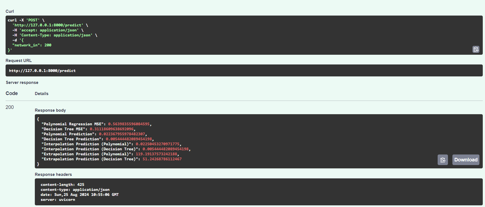

# ML Project with DuckDB and CPU Prediction

This project aims to build a machine learning model to predict CPU usage based on network input data using DuckDB for data storage and processing.

# Goals:

1.Load the data from the Duck DB file

2.Understand the relationship between `network_in` (x) and `cpu` (y) to build a model

3.Build a machine learning model to predict CPU usage based on the network in usage. Since linear regression won't work perfectly, I use Polynomial Regression here.
The relationship between `network_in` and `cpu` is smooth and can be approximated by a mathematical curve.

4.Make predictions for interpolation and extrapolation, use the trained model to make predictions both within and outside the range of the training data

## Folder Structure

- `data/`: Contains the DuckDB file with the data.
- `app/`: Source code for data loading, preprocessing, model training, evaluation, and prediction.
- `tests/`: Unit tests for the code.
- `mlenv/`: Virtual environment folder.

## Setup(locally without docker)

1.  Clone the repository.
2.  Install Python (version 3.12 recommended).
3.  Create a virtual environment:

    ```bash
    python -m venv mlenv
    mlenv\Scripts\activate

    ```

4.  Install the dependencies

    ````
    pip install -r requirements.txt

        ```

    ````

5.  Files Summary:

    1.data_loader.py: Loads data from DuckDB.
    2.preprocessing.py: Preprocesses the data (splitting, scaling, etc.).
    3.models.py: Defines and trains models.
    4.evaluation.py: Evaluates models (e.g., calculating MSE).
    5.prediction.py: Makes predictions using the trained models.
    6.app.py: Ties everything together to load data, train models, evaluate them, and make predictions.

6.  cd /app
    uvicorn app:app --port 0.0.0.0 --port 8000

7.  check the swagger api documentation at http://127.0.0.1:8000/docs

8.  ### How to use it (via docker):

```
Step 1:Clone the repository and set up project folder

git clone https://github.com/yolotalkies123/ML-project.git

cd ML-project


if you prefer docker compose, then

docker-compose up --build


Step5:Swagger documentation is available at `http://127.0.0.1:8000/docs`.

```



Summary:
In my project, I implement two regression models—Polynomial Regression and Decision Tree Regression—to analyze and predict CPU usage based on network input data. Polynomial Regression captures complex, non-linear relationships by fitting a polynomial function to the data, while Decision Tree Regression builds a tree-like model of decisions to predict outcomes. I train and evaluate both models, using metrics like Mean Squared Error to gauge their performance. The FastAPI application provides an endpoint for users to input data and receive predictions from both models, enabling a comparison of their predictive accuracy
